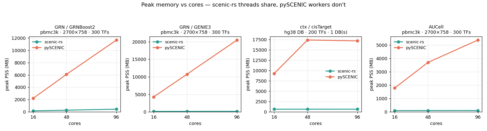
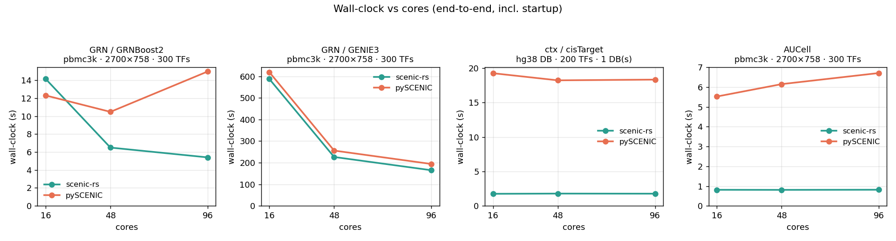

# scenic-rs

A memory-efficient Rust backend for the [pySCENIC](https://github.com/aertslab/pySCENIC)
single-cell gene regulatory network (GRN) pipeline.

## Benefits

Meant as a replacement for pySCENIC. Implements the same algorithms.

- Can use modern numpy/pandas in your environment
- Memory usage is constant with increased parallelism, allowing for faster execution without OOM

## Requirements

**Runtime** (using scenic-rs)
- Python ≥ 3.9
- `numpy`, `pandas` — pulled in automatically as dependencies
- For the **`ctx`** step only: the cisTarget **ranking databases**
  (`*.genes_vs_motifs.rankings.feather`) and the **motif2TF annotations** (`.tbl`),
  from [resources.aertslab.org/cistarget](https://resources.aertslab.org/cistarget/)

**Building from source**
- A recent stable **Rust** toolchain (`cargo`/`rustc`) — ≥ 1.70 (tested on 1.86);
  install via [rustup.rs](https://rustup.rs). The Arrow feather reader is pure
  Rust, so no system C/Fortran libraries are required.
- **maturin** ≥ 1.0 (`pip install maturin`)

**Benchmarks / validation only** (optional)
- A separate pySCENIC environment to compare against:
  `python3.10 -m venv ~/venvs/pyscenic_clean && ~/venvs/pyscenic_clean/bin/pip install "numpy<1.24" "pandas<2" pyscenic`
- `matplotlib` + `scipy` for the plotting and validation scripts

## Build

```bash
maturin develop --release          # builds the Rust core into the active env
python examples/run_example.py
```

## Usage

scenic-rs works on a **cells × genes** expression matrix (numpy, `float32`) plus
the gene names and a TF list. Load it however your data is stored:

```python
import numpy as np

# from an .npz with X / genes / tfs arrays (e.g. the prepped benchmark files)
z = np.load("data.npz", allow_pickle=True)
X, gene_names, tf_names = z["X"].astype("float32"), list(z["genes"]), list(z["tfs"])

# ...or from an .h5ad (AnnData), e.g. the TKO/DKO/WT data (needs `scanpy`)
import scanpy as sc
adata = sc.read_h5ad("counts.h5ad")
Xc = adata.layers["counts"]                                   # raw counts (your layer may differ)
X = np.asarray(Xc.todense() if hasattr(Xc, "todense") else Xc, dtype="float32")  # cells × genes
gene_names = adata.var_names.tolist()
tf_names = [g for g in open("allTFs_hg38.txt").read().split() if g in set(gene_names)]
```

Then run the pipeline (no Dask):

```python
from scenic_rs import grnboost2, genie3, aucell, RankingDb, ctx

# 1. GRN: TF -> target importances  (pandas DataFrame [TF, target, importance])
adj = grnboost2(X, gene_names, tf_names)        # default — fast, OOB early stopping
# adj = genie3(X, gene_names, tf_names)         # alternative — random forest, slower, ~same result (use one)

# 2. ctx: prune co-expression modules to motif-supported regulons
dbs = [RankingDb("hg38_...genes_vs_motifs.rankings.feather", "hg38")]
regulons = ctx(adj, X, gene_names, dbs, "motifs-...hgnc-...tbl")   # -> [Regulon(...)]

# 3. AUCell: per-cell regulon activity
auc = aucell(X, gene_names, {r.name: r.genes for r in regulons})
```

`adj` matches pySCENIC's adjacencies format and `ctx` matches its regulon output,
so any step can also be swapped in individually alongside pySCENIC.

## Validation & benchmarks (vs real pySCENIC)

- Running each step (grnboost2/genie3/aucell/ctx) in both scenic-rs and pySCENIC 0.12.1 / ctxcore 0.2.0
- Uses the same inputs (pbmc3k 2700 cells × 758 genes, 300 TFs), (hg38 cisTarget DB 5876 motifs × 27015 genes + motif2tf annotations)
- Equal cores — rayon threads = pySCENIC's Dask-worker count
- Backend startup counted on both sides

### Correctness — scenic-rs reproduces pySCENIC's numbers

| step | concordance vs pySCENIC |
|---|---|
| GRN / GRNBoost2 | Spearman **0.74**, top-1000 edge Jaccard 0.56 — *at the stochastic ceiling* |
| GRN / GENIE3 | Spearman **0.99**, per-target median 0.99 |
| ctx / cisTarget | per-(module,motif) NES Spearman **1.00** (max diff 1.4e-13) |
| AUCell | Spearman **0.98**, max abs diff 0.06 |

GRNBoost2 is stochastic — running the algorithm twice (different seed) only agrees ~0.73 per target.


### Memory & speed

- Peak memory (PSS) is **constant** in scenic-rs as cores increase, but
grows ~linearly in pySCENIC (per-worker copies). Ratios = pySCENIC / scenic-rs:

| step | memory: 16c → 96c | speed (equal cores) |
|---|---|---|
| GRN / GRNBoost2 | **13× → 26×** less | 0.9× @16c → **2.8× @96c** |
| GRN / GENIE3 | **30× → 123×** less | ≈ par (compute-bound) |
| ctx / cisTarget | **14× → 26×** less | **~10× faster** (flat vs cores) |
| AUCell | **18× → 51×** less | **~170× faster** (algorithm) |

At 96 cores pySCENIC peaks at ~11.7 GB (GRNBoost2), ~20.5 GB (GENIE3) and ~17 GB
(ctx); scenic-rs stays at ~0.45 GB, ~0.17 GB and ~0.66 GB respectively.




### Reproduce

Needs a pySCENIC env, e.g.
`python3.10 -m venv ~/venvs/pyscenic_clean && ~/venvs/pyscenic_clean/bin/pip install "numpy<1.24" "pandas<2" pyscenic`:

```bash
# correctness + cached adjacencies (GRN + AUCell)
python bench/benchmark_pyscenic.py --workers 16 --genie3
# memory/time scaling sweep across cores (GRNBoost2, GENIE3, AUCell)
python bench/mem_benchmark.py --sweep 16,48,96 --genie3
# ctx scaling sweep (real hg38 DB)
python bench/benchmark_ctx.py --sweep 16,48,96
# ctx per-step parity checks (math, DB, modules, regulons, NES concordance)
PYTHONPATH=python ~/venvs/pyscenic_clean/bin/python bench/validate_ctx_regulons.py
# render figures
python bench/plot_benchmark.py        # concordance.png, grn_per_target.png
python bench/plot_mem_benchmark.py    # mem_scaling.png, time_scaling.png (all steps)
```
