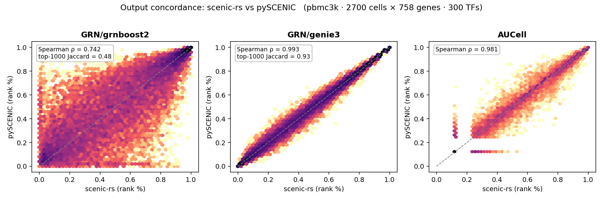
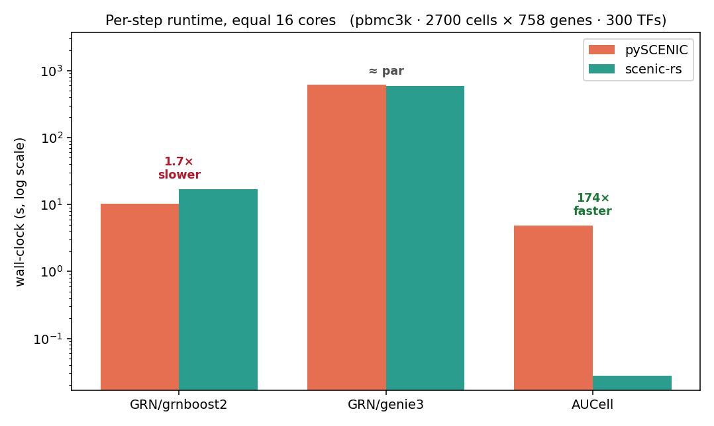
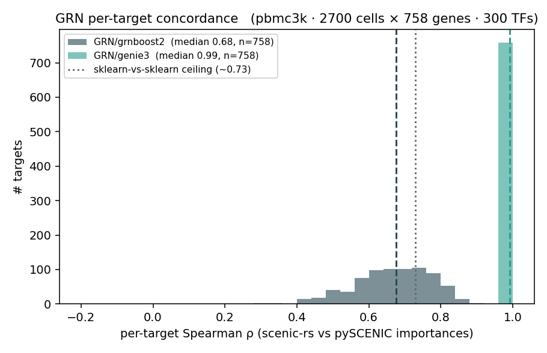

# scenic-rs

A blazingly-fast Rust backend for the [SCENIC](https://github.com/aertslab/pySCENIC)
single-cell gene regulatory network (GRN) pipeline.

**Status:** working MVP — the GRN step (GENIE3 + GRNBoost2 with out-of-bag early
stopping) and AUCell reimplemented as a Rust core with `rayon` parallelism and
`PyO3` bindings. No Dask, `pip`-installable, drop-in for pySCENIC's GRN and
AUCell steps.

## Why

pySCENIC is the standard for RNA-only GRN inference but is effectively inactive
(no release in 12+ months), and its GRN step — GRNBoost2/GENIE3 via `arboreto` —
is the #1 user pain: **Dask dependency hell** — `numpy<1.24` / `pandas<2` pins
that conflict with modern scanpy, version breakage, and a cluster to babysit.

scenic-rs is a self-contained Rust core (`rayon` for parallelism, `PyO3`
bindings) that **removes Dask entirely** and reproduces pySCENIC's outputs as a
`pip`-installable drop-in. It is **not a faster GRN engine** — at equal cores the
GRN steps are roughly on par with arboreto (sklearn's tree code is already
optimized C). The win is dependencies and simplicity, plus a large **AUCell**
speedup that comes for free from skipping Dask's per-step startup. See
[Validation & benchmarks](#validation--benchmarks-vs-real-pyscenic) for honest,
equal-core numbers.

## Build

```bash
maturin develop --release          # builds the Rust core into the active env
python examples/run_example.py
```

## Use

```python
from scenic_rs import genie3
adj = genie3(expr, gene_names, tf_names)   # pandas DataFrame [TF, target, importance]
```

`adj` matches pySCENIC's adjacencies format, so it feeds straight into the
downstream `ctx` (cisTarget) and AUCell steps.

```python
from scenic_rs import grnboost2, aucell
adj = grnboost2(expr, gene_names, tf_names)         # GRNBoost2 with OOB early stopping
auc = aucell(expr, gene_names, regulons)            # {name: [genes]} -> cells × regulons
```

## Validation & benchmarks (vs real pySCENIC)

Every step is run in **both** scenic-rs and **pySCENIC 0.12.1** on the *same*
pbmc3k matrix (2700 cells × 758 genes, 300 TFs), made apples-to-apples by
construction:

- **equal cores** — rayon threads pinned to pySCENIC's dask-worker count
- **identical input** — both load the same in-memory array; no CSV-IO on either
- **startup counted on both** — dask cluster spin-up (pySCENIC) and rayon pool
  init (scenic-rs) are inside the timed region

| step | concordance (Spearman vs pySCENIC) | speed @ equal 16 cores |
|---|---|---|
| GRN / GRNBoost2 | **0.74** (top-1000 edge Jaccard 0.56) | 1.6× slower |
| GRN / GENIE3 | **0.99** | ≈ par |
| AUCell | **0.98** (max abs diff 0.06) | **~170–200× faster** |





**Reading the results**

- **AUCell** is the standout: numerically the same as pySCENIC (ρ 0.98) and
  ~200× faster — pySCENIC's per-step wall-clock is dominated by Dask/pool startup
  that scenic-rs simply doesn't pay.
- **GENIE3** matches almost exactly (ρ 0.99) at parity speed. Both are optimized
  tree code (sklearn's C random forest vs our Rust), so neither wins on raw speed.
- **GRNBoost2** reproduces pySCENIC's importances *above* the stochastic ceiling
  (sklearn-vs-sklearn on two seeds ≈ 0.73), using the same OOB early stopping. It
  is ~1.6× slower than arboreto on this size; here the win is removing Dask, not
  raw GRN speed.

**Why use it, then?** No Dask: `pip install`, no `numpy<1.24`/`pandas<2` pin hell,
no cluster to babysit — same outputs, with AUCell ~200× faster as a bonus.

Reproduce (needs a pySCENIC env, e.g.
`python3.10 -m venv ~/venvs/pyscenic_clean && ~/venvs/pyscenic_clean/bin/pip install "numpy<1.24" "pandas<2" pyscenic`):

```bash
python bench/benchmark_pyscenic.py --workers 16 --genie3   # runs both, caches outputs
python bench/plot_benchmark.py                              # writes bench/figures/*.png
```

The legacy sklearn/numpy-reference checks still live in
`bench/validate_genie3.py` and `bench/validate_more.py`.

## Roadmap

- [x] GENIE3 (random forest) GRN inference, parallel over targets
- [x] GRNBoost2 (gradient-boosting) variant
- [x] OOB early stopping for GRNBoost2 (matches arboreto's regularizer)
- [x] AUCell in Rust (parallel over cells)
- [x] pySCENIC-compatible adjacencies output (TF, target, importance)
- [x] Validation + benchmark harness against real pySCENIC
- [ ] Histogram-based tree splits (the real GRN speed unlock)
- [ ] Scaling study across core counts (rayon vs Dask overhead)
- [ ] cisTarget / `ctx` motif step (later)
- [ ] AnnData / loom convenience loaders
